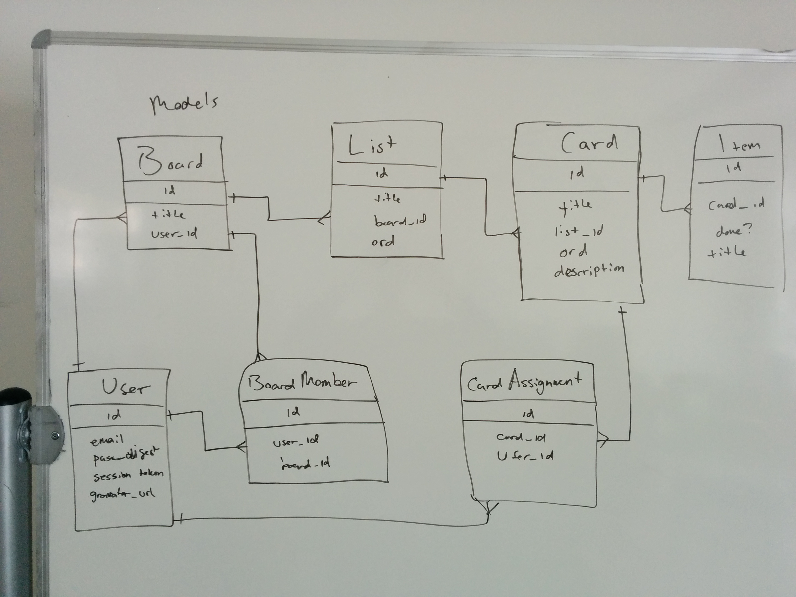

# Trello project!

Over the next few days, you will build a clone of [Trello](https://trello.com/).

The intention of this project is to practice building something a bit bigger on 
your own in preparation for the final project. This means that these 
instructions are intentionally vague.

Below you will find a both terse and detailed instructions. We challenge you to 
attempt the project using only the terse instructions, but the detailed 
instructions are also there as a safety net :gift:.

This project provides authentication and a Rails API so you can focus on 
Backbone, Bootstrap and jQuery UI.

Take some time to browse the code provided for you. In this project, you'll 
deal with the models in the following order: `Boards`, `Lists`, `Cards`, 
`TodoItems`, and `CardAssignments`. `Lists` and `Cards` have an `ord` attribute 
that corresponds to the order they're shown in. By the end of this project, 
you'll be able to edit their order by dragging and dropping them.

## Terse instructions

Make the show, index, and new page for boards. Next, add lists to the boards. 
Then add cards to the lists. Then add drag and drop functionality. Then make 
that card modal view. Congratulations, you just made Trello. :beers:

## Detailed instructions

### Phase I: Boards Index

* Start up Backbone. Remember to check that you're getting that annoying "Hello 
from Backbone" alert.
  * Make your Backbone model and collection for boards.
  * Make a trello.js file in your javascripts folder. In it, initialize Backbone.
  * Test out your Backbone model: if you use its `save` method, it should save 
the model to the database.
* Build a `BoardsIndex` view class. Its `render` function should put an 
unordered list of our boards on the page.
* Add a Backbone router: map "/" to the `BoardsIndex` class. At this point, you 
should be able to see all your boards on your index page.
* Add a new board view class, so that you can create boards.

### Phase II: Board Show and Lists

* On your index page, give every board a link to its show page.
* Make the board show page. Add a Backbone route to it. For the moment, just 
have a board's show page contain the name of the board and a list of its lists. 
You can just display a list's name, given that at the moment it has no other 
content.
  * Remember to display the lists in order of their rank. You might want to 
overwrite the `comparator` method of the `lists` collection.
* When the user creates a board, it should redirect them to the board's show 
page. You can use the router's `navigate` method for this.
* Add the ability to create lists, via a new list view.
* Add the ability to add board members. You should be able to type in a email 
and the website will add that person, or complain that they don't exist.
* Add a button to delete the board.

### Phase III: Cards (finally!)

* Make your board show page also show the cards for each list. You'll want to 
do this by adding functionality to the BoardShow.js render method. Again, 
remember to order them by rank, by overwriting the default comparator method.
* Make the lists appear next to each other by making each inside a div which you 
give the CSS setting `float: left`.
* Add the ability to create and delete cards for each list. *TODO: elaborate on 
how to do this in Backbone.* The card deletion should be accomplished by a 
button for each card which only appears when you're hovering over the card. Use 
the JQuery hover event to get this effect.

### Phase IV: Javascript prettiness!

* The whole fun of Trello is the dragging and dropping of the to-do items and 
lists. We'll be using jQuery UI Sortable to accomplish this. 
[Read this example here](http://stackoverflow.com/a/15635201).
* First get that working on the client, and then send the result back to the 
server.
* To make it prettier, you can give the cards a `.dragged` CSS style which 
rotates them slightly and gives them a shadow while they're being dragged.
* While we're making things pretty, change your forms so that if you enter 
invalid input, for example by not giving a card a name before creating it, the 
input element flashes. Use the jQuery UI 
[Highlight effect](https://api.jqueryui.com/highlight-effect/) for this.
* Also, go back to your Board show page. We want to make it harder to delete 
your board by accident. So when you click the 'delete' button, a 
[modal](http://getbootstrap.com/javascript/#modals) should pop down asking if 
you're sure you want to delete the board. Make this modal by displaying two 
divs:
  * The first div is to grey out the rest of the window. Just make it have a 
fixed height and width of 100%, and give it a semitransparent black color.
  * On top of that div, make a centered div which has a button to confirm the 
deletion of the board.
  * I know that Bootstrap has modals built in, but build this from scratch 
anyway.
  * You can get advice on this part of the process from 
[this tutorial](http://www.jacklmoore.com/notes/jquery-modal-tutorial/).

### Phase V: Card modal view

* We want to make a modal view to focus on a particular card. Refer to the 
advice included in part II on making modals.
* Within the card modal, we want to show to-do items.
  * To-do items can be created and deleted, and each has a checkbox whose state 
should be saved to the server whenever it is changed.
* Also, we want assigned users.
  * Cards have an arbitrary number of assigned users. Note that you only want 
to give the option of adding users who haven't already been added.

### Bonus round

* Add Javascript prettiness everywhere. Make modals to confirm that you 
actually want to delete things. Think of more pretty things to do, then do 
them and add them to these instructions.

### Planning

